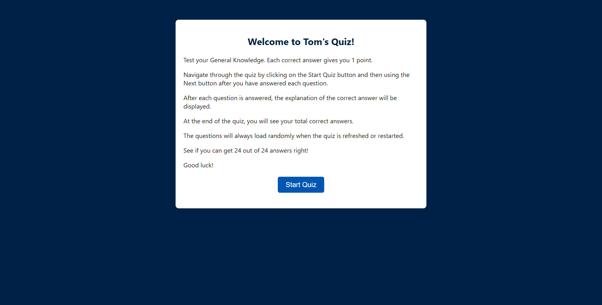
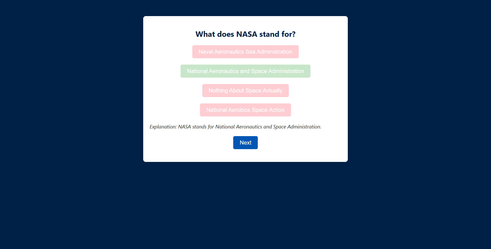
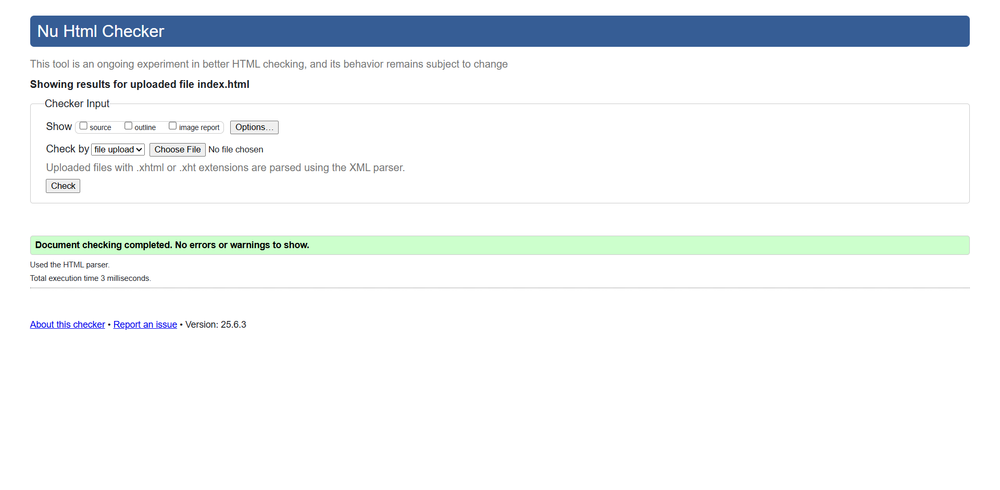
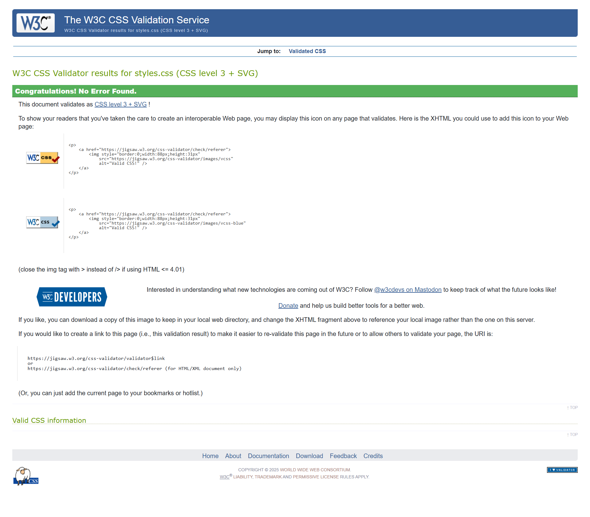
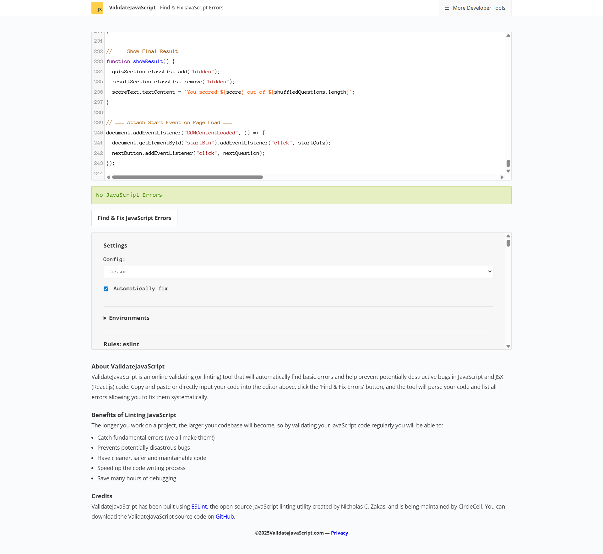

# Tom's Quiz

Welcome to Tom's Quiz! This is a fun and interactive general knowledge quiz web app built with HTML, CSS, and JavaScript.

## Features
- 24 randomised general knowledge questions
- Instant feedback and explanations for each answer
- Accessible and responsive design
- Score tracking and restart option

## How to Use
1. Open `index.html` in your browser.
2. Click "Start Quiz" to begin.
3. Answer each question and view explanations.
4. See your final score and try again!

## Screenshots
Below are some screenshots of Tom's Quiz in action:

### Start Screen

### Quiz Question

### Result Screen

## Project Structure
- `index.html` - Main HTML file
- `css/styles.css` - Stylesheet
- `js/main.js` - Quiz logic
- `assets/` - Images and other assets

## Code Validation

HTML Validation - No Errors

CSS Validation - No Errors

JavaScript Validation - No Errors

## General

I have over 21 years experience coding and using HTML, CSS and PHP for personal websites. I found the HTML and CSS aspect of this quiz easy to do. JavaScript has been relatively new for me to use even though certain aspects of JavaScript are in PHP. I managed to get the foundations of the quiz in JavaScript done and was told by my mentor that I had the core mechanics outlined in the brief I was given. I kept pushing my JavaScript coding by doing more research on online of how to do this, as well as reading up more on JavaScript in two books I have on Coding All-In-One for Dummies by Chris Minnick and JavaScript All-In-One for Dummies. I have enjoyed doing this quiz. I initially demonstarted the quiz is working on a 3rd party web hosting platform DirectAdmin but was told to use github so transferred all the coding over to git hub where it is now displayed.

My coding has ended up being 74.1% JavaScript, 14.5% HTML, CSS 11.4%. I concentrated JavaScript in this quiz to prove to myself I can use JavaScript and to prove that I have taken on board what I have learnt in the course I am doing. 